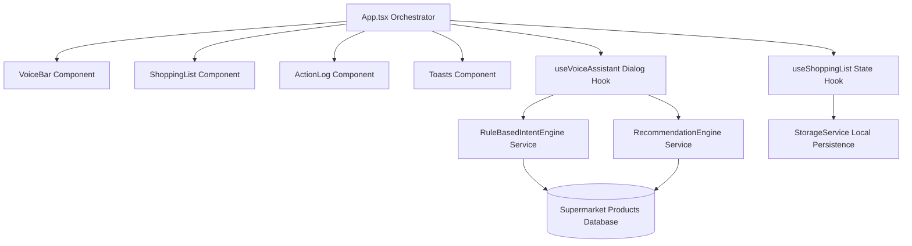

# Voice Shopping Assistant - Technical Approach Summary

## Approach Write-up (Max 200 words)
Our voice-first supermarket shopping assistant uses a decoupled React/TypeScript architecture separating state hooks (`useShoppingList`, `useVoiceAssistant`) from pure service engines. Speech input uses the HTML5 Web Speech API (with manual fallback), feeding into a deterministic regex NLP engine (`RuleBasedIntentEngine`). This parser extracts item names, Hindi/transliterated numerals, and associates quantities and units (e.g. kg, L, packets) across multi-item sentences.

The assistant references an internal supermarket dataset (`SUPERMARKET_PRODUCTS`) containing common categories, brands, package sizes, Hindi synonyms (e.g. aloo -> potato), and discounted prices (calculated via MRP and discount percentages). The search routing extracts brands, dietary tags, and price limits conversationally, prompting select-from-search commands ("Add the first one").

Smart recommendations analyze seasonal flags and database discounts, suggesting them conversationally and requiring explicit confirmation ("Yes, add it") before editing. If an item is out-of-stock, category substitutes are offered. The estimated total reactively sums active/unpurchased items. Malformed storage recovery is handled via a top-level ErrorBoundary wrapper, guaranteeing high accessibility (ARIA-compliant inputs, semantic markup) and offline-first stability.

---

## Decoupled V3 Architecture Diagram

---

## Assignment Feature Grid

| Feature | Details | Verification Command |
| :--- | :--- | :--- |
| **Voice commands** | Continuous SpeechRecognition Web Speech API | *"Add milk"* |
| **NLP** | Varied flexible commands parsing | *"I need bread please"* |
| **Multilingual** | Triggers English/Hindi/Spanish | *"Curd add karo"* |
| **Multi-item Parsing** | Segmented entity parsing | *"1 kg mango and 2 kg papaya"* |
| **Quantity & Units** | Quantity-unit mapping per item | *"2 packets of biscuits"* |
| **Categorization** | Categorizes dynamically | *"Fruits", "Dairy & Eggs"* |
| **Voice Search** | Searches brands/tags/limits | *"Find toothpaste under ₹300"* |
| **Smart Suggestions** | History, seasonal and discounts | *"What should I buy?"* |
| **Substitutes** | Offers available category options | *"Add regular milk"* |
| **Supermarket Data** | 35+ items, brands, package sizes | Used internally |
| **Discount Pricing** | Uses discounted selling price | Selling Price = MRP - Discount |
| **Estimated Total** | Sums unpurchased active list items | Displayed reactively |
